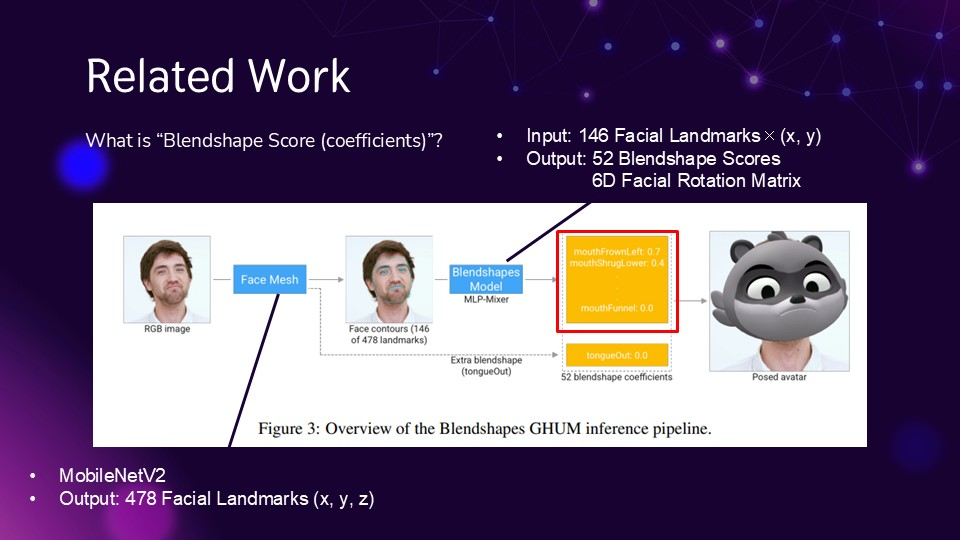
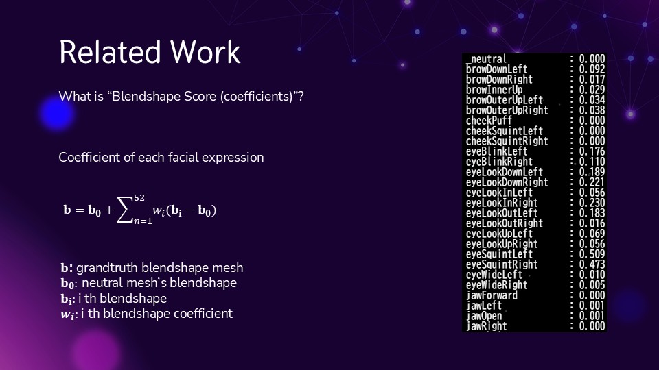

# A Particle System that Change with Facial Expressions


## Overview

This project combines 3D visualization with deep learning by creating a facial expression-responsive animation system.

By mapping expressions like smiles and surprise to particle motion, the system allows users to interact with particles in a more natural and immersive way. It also has potential benefits in fields such as game effects and interactive entertainment.

## Demo
[CLICK HERE](https://hal-val.github.io/3D_final_project/ParticleSystem.html)  

## Technologies Used

- **Three.js** – for real-time 3D rendering and particle animation  
- **MediaPipe** – for facial landmark detection and expression recognition  
- **GPUComputationRenderer** – for GPU-accelerated particle simulation  
- **WebGL** – underlying rendering technology for 3D graphics in the browser

## Method
This particle system utilizes a model based on MediaPipe’s Face Landmarker, which calculates **Blendshape scores** from real-time facial input. These scores are used to define specific expressions, which in turn control particle motion and behavior.

The **Blendshape scores** refer to the values highlighted in red in the diagram below. These values are computed internally by the Blendshapes model.


<p float="left">
  
  
</p>


> For more details on how these models work and how the Blendshape scores are calculated, please refer to [the research papers](https://arxiv.org/abs/2309.05782) .

I selected some Blendshape scores to define two key expressions: “Smile” and “Surprise.”

Each expression is assigned a normalized intensity (ranging from 0.0 to 1.0), which directly influences particle behavior such as motion direction, speed, and color.

- `smileStrength`: Derived from the average of `mouthSmileLeft` and `mouthSmileRight`
- `surpriseStrength`: Based on a weighted combination of `eyeWideLeft`, `eyeWideRight`, and `jawOpen`

```js
// Expression strength calculation
// smiling
const smileStrength = (smileLeft + smileRight + eyeSquintLeft + eyeSquintRight) / 4;

// surprise
const surpriseStrength = Math.min((eyeWideLeft*90 + eyeWideRight*90 + jawOpen) / 3, 1.0);
```

These normalized values (range 0.0–1.0) are passed as uniforms into the shader to influence particle motion and color.

### Thresholds

- If `smileStrength > 0.2` and exceeds `surpriseStrength` by more than `0.1`,  
  → particles rotate counter-clockwise and float upward.

- If `surpriseStrength > 0.2` and exceeds `smileStrength` by more than `0.1`,  
  → particles rotate clockwise and are pulled downward.

- If neither condition is met (difference is small or both are low),  
  → particles do not rotate and gently float in place.

### Particle Color
- Base Color:
All particles start as white

- Smile (smileStrength):
Adds a pink tint as smileStrength increases.

- Surprise (surpriseStrength):
Adds a blue glow as surpriseStrength increases.


## Future Work

- Using raw BlendShape scores directly often leads to issues: many of the scores remain at zero or predict only minimal values, even when the user's facial movements are significant. This limits interactivity, as users need to exaggerate their expressions to see noticeable particle changes.

- In practical use cases like gaming, users rarely make such exaggerated expressions during play. Subtle changes in facial movement should still yield expressive feedback.

- Therefore, a future improvement would involve integrating an expression classification model (e.g., predicting the class such as “Happy” or “Angry”) instead of relying solely on raw values. This would allow for more intuitive and robust control of the particle system.

- Incorporating [the LSTM-based model from recent research](https://arxiv.org/abs/2501.13432) could improve stability and responsiveness in expression detection, enabling smoother interaction and more accessible user experience.

- The current system uses only two velocity patterns, and particles look best within the z = ±5 range. To improve visual appeal from all angles, future work could introduce varied speeds and less predictable, artistic motions beyond real-world physics.

- This project uses `GPUComputationRenderer` to compute particle velocity and position. Switching to CUDA could enable more advanced and detailed animations through high-precision physical simulations.


## References

- Reeves, W. T. (1998). Particle systems—a technique for modeling a class of fuzzy objects. In Seminal graphics: pioneering efforts that shaped the field (pp. 203-220).
- Grishchenko, Ivan, et al. "Blendshapes GHUM: Real-time Monocular Facial Blendshape Prediction." arXiv preprint arXiv:2309.05782 (2023).
- https://codepen.io/mediapipe-preview/pen/OJBVQJm
- https://particle-love.com/
- https://threejs.org/examples/webgl_gpgpu_birds.html

## Audio Credits

- Title: "birth of dragon"
- Author: Yuli
- Source: https://dova-s.jp/EN/bgm/play22337.html
- License: Royalty-free with attribution required
